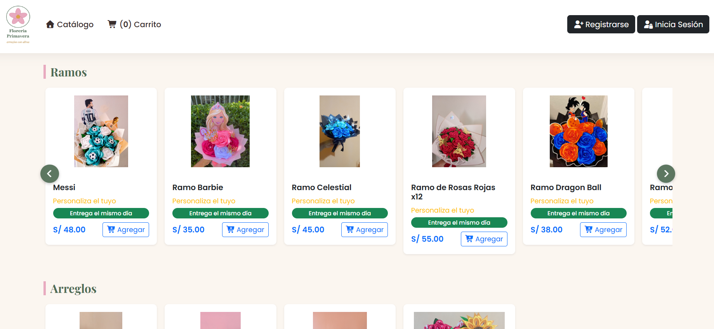
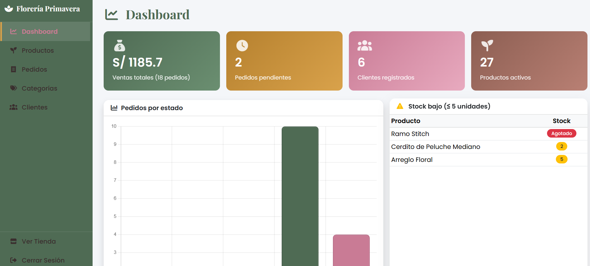
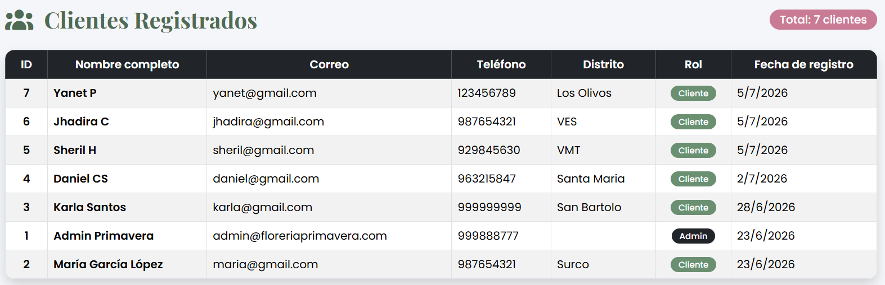
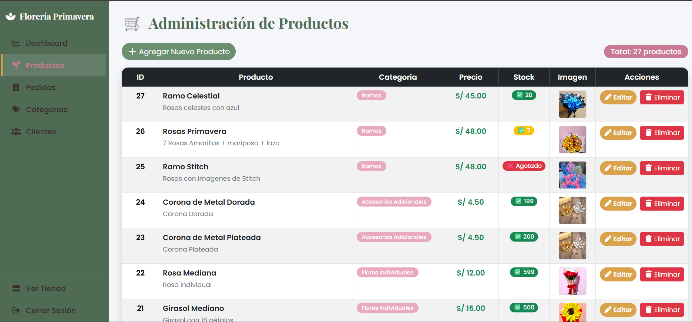
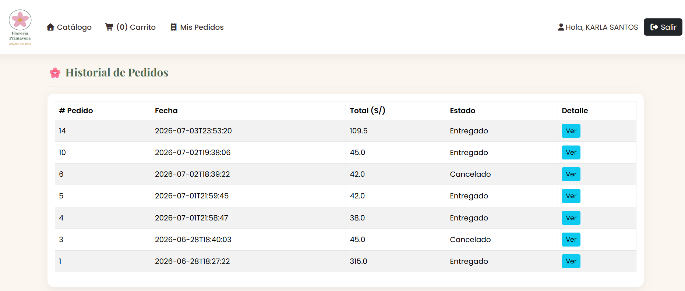
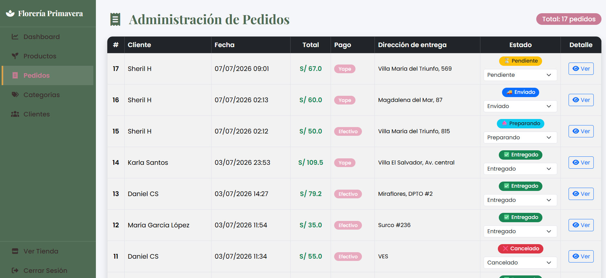

# 🎁 Gift Shop Management System

Gift Shop Management System is a web application developed to manage the daily operations of a personalized gifts and flower arrangement business.

The system centralizes customer information, order tracking, payments and product management, helping improve organization and efficiency.

---

## 📑 Table of Contents

- Overview
- Problem
- Solution
- System Modules
- Target Users
- Features
- Technologies
- Installation
- Screenshots
- Documentation
- Future Improvements
- License
- Skills Demonstrated
- Author

---

## 💡 Problem

Managing orders manually made it difficult to keep track of customers, payments and deliveries.

This application was developed to centralize business information and improve daily operations.

---

## 🎯 Solution

Developed a web-based management system that allows the business owner to manage customers, products, orders, payments and order status from a single platform.

---

## 📌 System Modules

✔ Customer Management

✔ Product Management

✔ Order Management

✔ Payment Registration

✔ Dashboard

✔ User Authentication

---

👨‍💼 Target Users

- Business owners
- Store administrators
- Sales staff

---

## ✨ Features

✔ User authentication.

✔ Customer Management

✔ Product Management

✔ Order Management

✔ Payment Registration

✔ Order status tracking

✔ Administrative Panel

---

## 🛠 Technologies

- Java
- NetBeans IDE
- MySQL
- HTML5
- CSS3
- Bootstrap
- JDBC

---

## ⚙ Installation

1. Clone the repository.

2. Import the project into NetBeans.

3. Create the MySQL database.

4. Import the SQL script.

5. Update the database connection.

6. Run the application.

---

## 📂 Project Structure

gift-shop-management-system/

├── codigo/
├── base_datos/
├── documentos/
├── capturas/
└── README.md

---

## 🗄 Database

The database script is located in:

├── base_datos/

It includes all required tables to run the application.

---

## 📖 Documentation

✔ Installation Manual

✔ Administrator User Manual

---

## 📷 Screenshots

✔ Login

✔ Dashboard

✔ Customer Management

✔ Product Management

✔ Order Registration

✔ Payment Module

---

## 🚀 Future Improvements

✔ Responsive interface

✔ Role-based authentication

✔ Sales reports

✔ Email notifications

✔ WhatsApp integration

✔ Cloud deployment

---

## 📄 License

This project was developed for educational purposes.

---

## 📈 Skills Demonstrated

- Object-Oriented Programming (OOP)
- CRUD Operations
- Database Design
- MySQL Integration
- User Interface Design
- Software Documentation
- Problem Solving

---

## 👩‍💻 About the Author

Karla Santos Villarreal

Systems Engineering Student at UNTELS.
Passionate about technology, software development and digital solutions that solve real-world problems.
Currently building projects to strengthen my professional portfolio.

